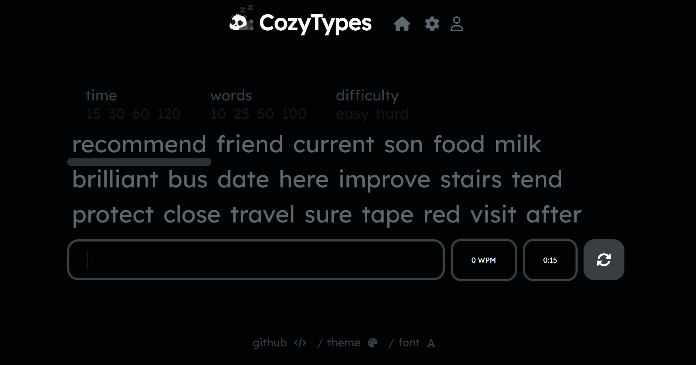

# cozytypes
 [cozytypes.com](https://www.cozytypes.com) is a simple and asthetic typing website for keyboard enthusiasts. Users can modify themes, fonts, and difficulty. 
 
 

## themes
users can select different themes by scrolling to the bottom of the preferences page. In addition to the provided themes, users can create their own.

available themes:

- `mizu` (GMK Mizu)
- `dracula` (GMK Dracula)
- `olivia` (GMK Olivia)
- `striker` (GMK Striker)
- `blueberry`
- `creamsicle` (Enjoypbt Orange Creamsicle)
- `botanical`(GMK Botanical)
- `luna`
- `8008` (GMK 8008)
- `9009`(GMK 9009)
- `sakura` (GMK Sakura)
- `light` 
- `dark`
## fonts
available fonts:
- `arial`
- `IBM Plex Sans`
- `comfortaa`
- `courier`
- `nutino`
- `source code pro`
- `raleway`
- `titillium web`
- `merriweather`
## caret
the default caret is a blinking cursor, however, users have the option of underlining the letter, word, or highlighting the word.
## blur
users can blur the following lines of text to further challenge themselves.
## difficulty
- `easy`(selects from a list of 100 simple words)
- `hard` (selects from a list of 1,000 difficult words)
## track progress
by creating an account, you have access to metrics such as tests completed, best typing speeds, along with many others.
## friends
by adding friends in the profile page, you are able to view their stats and metrics. 
